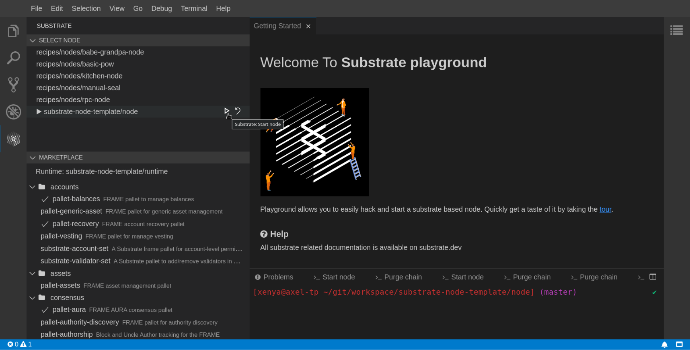

# Substrate - VSCode extension

Features
* Provides a quick access to the VSCode Actions provided in the workspace
* Detects the nodes in the workspace and lets you run them, or purge the chain
* Detects the runtimes in the workspace and lets you see which pallets they use, gives you access to their documentation, and lets you install additional pallets easily from the Substrate Marketplace
* Lists running processes, lets you kill them or access their terminal
* Account management (for testing purposes)
* Compile, deploy and call smart contracts

Visit the extension's page on Visual Studio Marketplace: https://marketplace.visualstudio.com/items?itemName=paritytech.vscode-substrate



This extension is work in progress and is in active development. Please [report](https://github.com/paritytech/vscode-substrate/issues/new) any issues you encounter. The context and roadmap can be found [here](https://github.com/paritytech/substrate-playground/issues/28).

## Installation

Launch VS Code Quick Open (Ctrl+P), paste the following command, and press enter.

```
ext install paritytech.vscode-substrate
```

Alternatively, search for "VSCode Substrate" in the extension marketplace.

## Development

Clone, run `yarn` to install the dependencies, open the folder in VSCode, run the command "Debug: Start Debugging" to launch a new VSCode instance with the extension running.