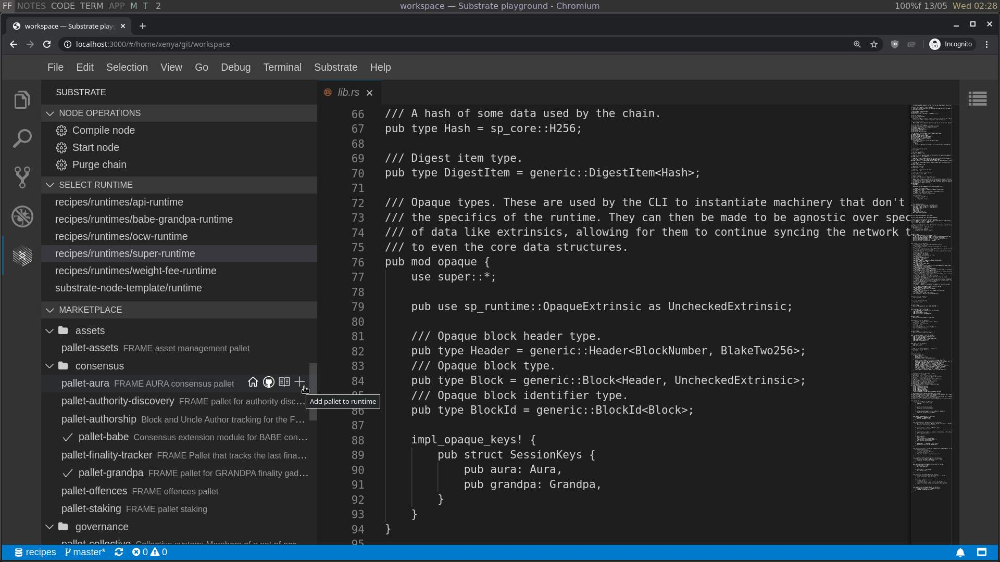

# Substrate - VSCode extension

Browse and install pallets from the Substrate Marketplace and manage your node.

https://github.com/paritytech/substrate-playground/issues/28

## Installation

Head over to the [Releases](https://github.com/paritytech/vscode-substrate/releases) page and download the `.vsix` file from the latest release. Open VSCode, and run "Extensions: Install from VSIX" in your command palette.

## Development

Clone, run `yarn` to install the dependencies, open the folder in VSCode, run the command "Debug: Start Debugging" to launch a new VSCode instance with the extension running.