# Features

- [Features](#features)
  * [1. Workspace actions](#1-workspace-actions)
    + [1.1 Run workspace actions](#11-run-workspace-actions)
  * [2. Node actions](#2-node-actions)
    + [2.1 Compile & run a node](#21-compile---run-a-node)
    + [2.2 Run an already compiled node](#22-run-an-already-compiled-node)
    + [2.3 Kill a process](#23-kill-a-process)
    + [2.4 Purge a node's chain](#24-purge-a-node-s-chain)
  * [3. Runtime actions](#3-runtime-actions)
    + [3.1 Get information on installed pallets](#31-get-information-on-installed-pallets)
    + [3.2 Add a new pallet](#32-add-a-new-pallet)
  * [4. Account management](#4-account-management)
    + [4.1 Import an account](#41-import-an-account)
    + [4.2 Import an account from JSON](#42-import-an-account-from-json)
    + [4.3 Generate a new account](#43-generate-a-new-account)
    + [4.4 Rename, copy address, export, remove account](#44-rename--copy-address--export--remove-account)
  * [5. Contracts](#5-contracts)
    + [5.1 Compile & deploy a contract](#51-compile---deploy-a-contract)
    + [5.2 Call a contract method](#52-call-a-contract-method)
    + [5.3 Copy hash, forget contract](#53-copy-hash--forget-contract)

Access the extension's features by clicking the "Substrate" icon to the left.

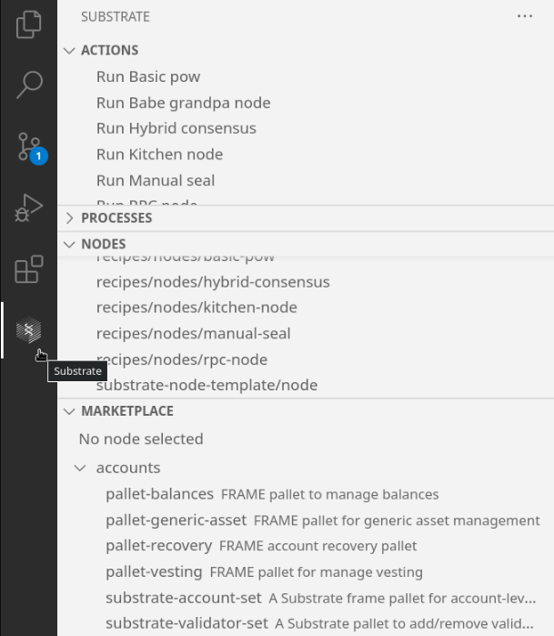

## 1. Workspace actions
  ### 1.1 Run workspace actions
  The extension will detect all VSCode actions provided in your workspace folders and list them under the "Actions" panel. Hover over an action and click the "Execute" icon to the right to run it.

  

## 2. Node actions
  ### 2.1 Compile & run a node
  The extension will detect all nodes (binary Rust projects) in the workspace and list them in the "Nodes" panel. To compile and run a node, hover over the node in the list and click the corresponding icon. The new process will be listed under "Processes" and a new terminal will be opened with the process's ouput.

  

  ### 2.2 Run an already compiled node
  If you have already compiled the node and which to run it again without compiling the new changes, click the "Start node" button. The new process will be listed under "Processes" and a new terminal will be opened with the process's ouput.

  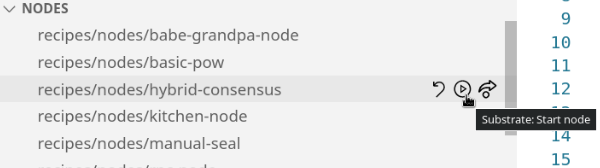

  ### 2.3 Kill a process
  Once a node is running, you can exit it by clicking the "Stop process" icon.

  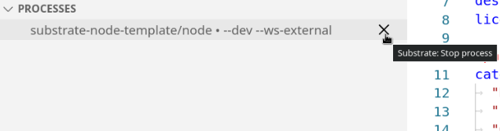

  ### 2.4 Purge a node's chain
  You can purge the chain of an already compiled node by clicking the "Purge chain" icon.

  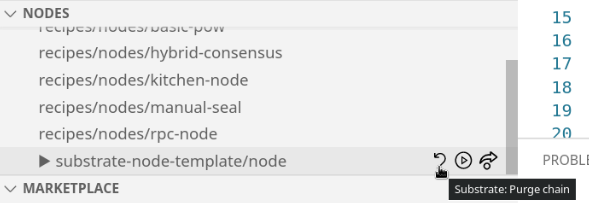

## 3. Runtime actions

  ### 3.1 Get information on installed pallets
  First, select a node.

  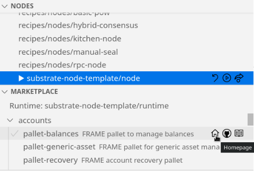

  The runtime used by this node will be automatically detected and displayed in the "Marketplace" panel. The "Marketplace" panel will then list all pallets available, and add a checkmark next to those that are used by the runtime of the selected node. Hover over each pallet to get access to their homepage, documentation page and GitHub page.

  ### 3.2 Add a new pallet
  To add a pallet as a dependency of the runtime, click the "Add pallet" icon. This will install the pallet using the tool `substrate-deps`, installing it if necessary.

  

## 4. Account management
  Please note that this extension's account management features are meant to be used for testing/development purposes only. The accounts are persisted across restarts.

  ### 4.1 Import an account
  To add an account, hover over the "Accounts" bar and click the "+" icon. You will then be asked for a human-friendly name, cryptographic type and the key to the account.

  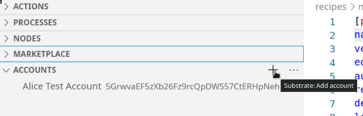

  ### 4.2 Import an account from JSON
  You can also import an account from a JSON file by clicking on the "Next actions" icon next to the "+" icon, then choosing "Import account from JSON."

  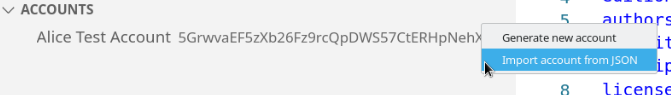

  ### 4.3 Generate a new account
  You can also generate a new account with a random seed by clicking "Generate new account".

  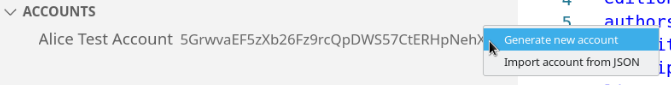

  ### 4.4 Rename, copy address, export, remove account
  By right-clicking an account, you can rename it, copy its address, export it as a JSON file, or remove the account from the list.

  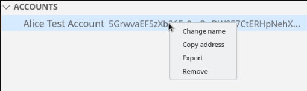

## 5. Contracts
  Contracts are persisted across restarts and are linked to a WebSocket endpoint (host and port). You need to have added an account in the extension in order to be able to deploy a contract.

  ### 5.1 Compile & deploy a contract
  Select a running process. This will list the contracts you already added to this endpoint in the extension (if any).

  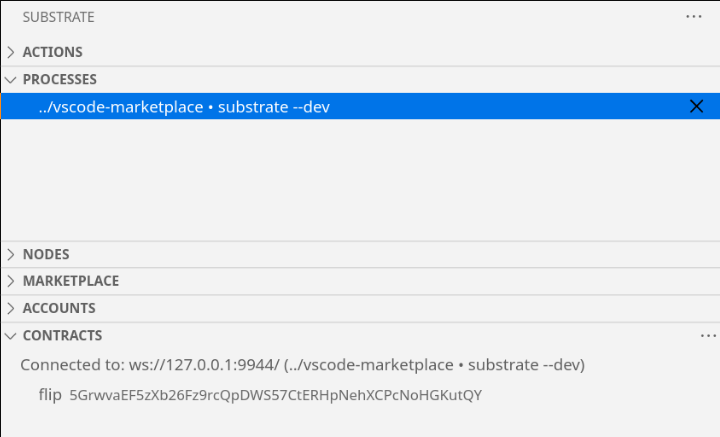

  You can compile an __ink!__ project, upload its WASM code and instantiate the contract with one click by clicking the "..." icon after hovering over "Contracts", and then selecting "Compile & deploy contract". You will then be asked for the location of your __ink!__ project, a human-friendly name for the contract, the account (see section 4) with which to upload the WASM & deploy the contract, its password, the constructor to use when instantiating the contract, if necessary its arguments, the endowment and maximum amount of gas for the deployment. The contract will then be listed in the "Contracts" panel.

  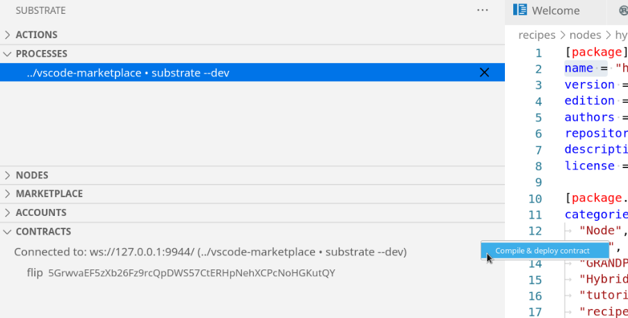

  ### 5.2 Call a contract method
  Right-click a contract and click "Call contract method". You will then be asked various information and be informed of the progress of the transaction.

  

  ### 5.3 Copy hash, forget contract
  By right-clicking a contract, you can also copy its hash or remove the contract from the list.

  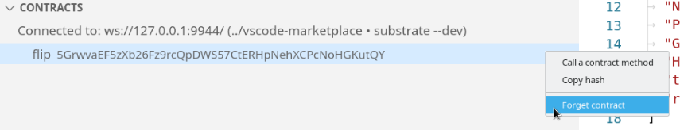